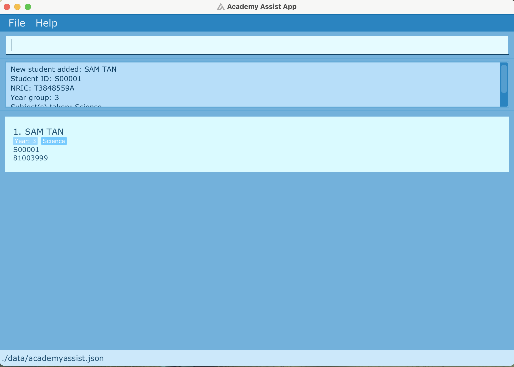
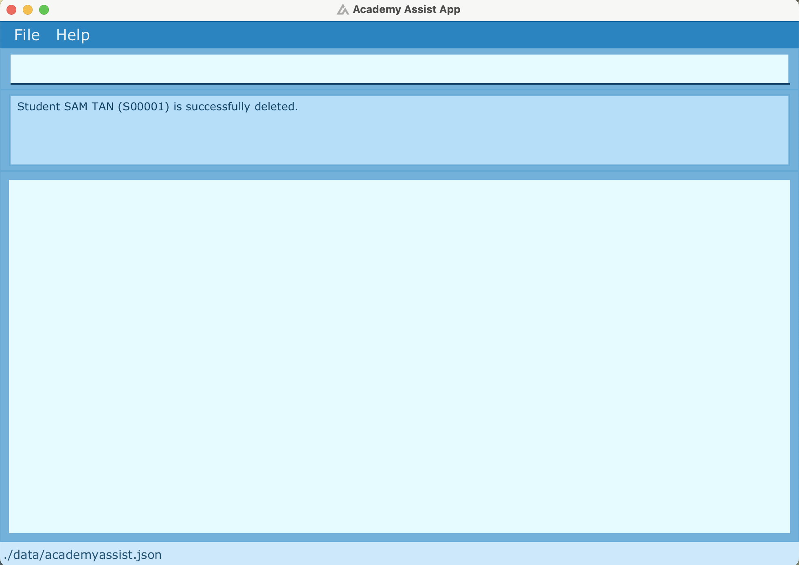
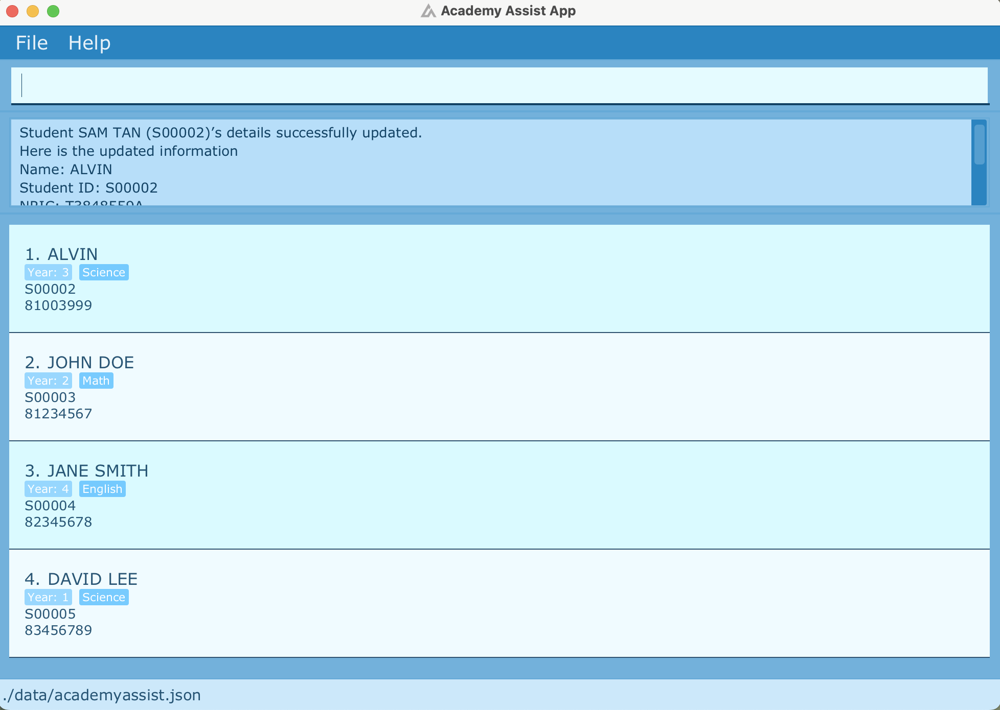
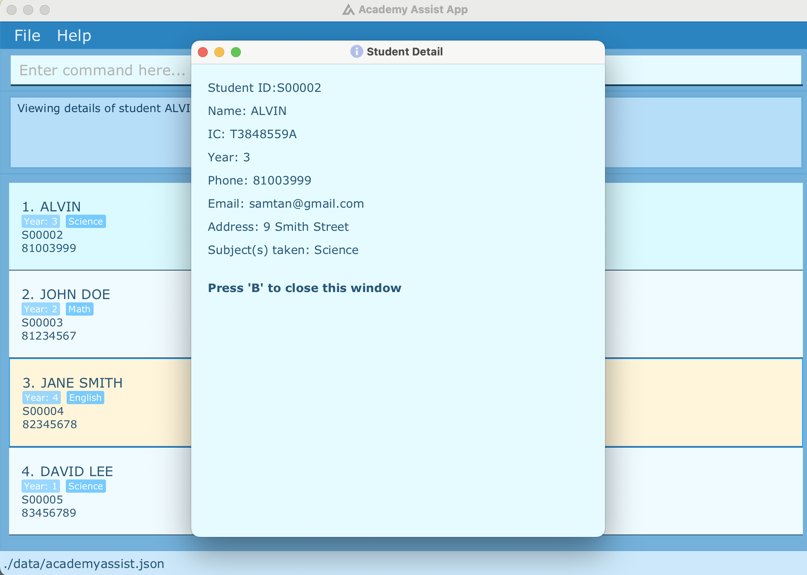
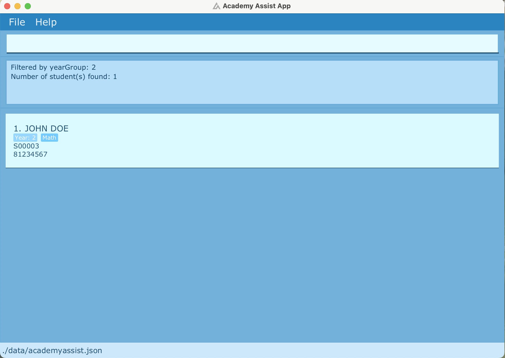
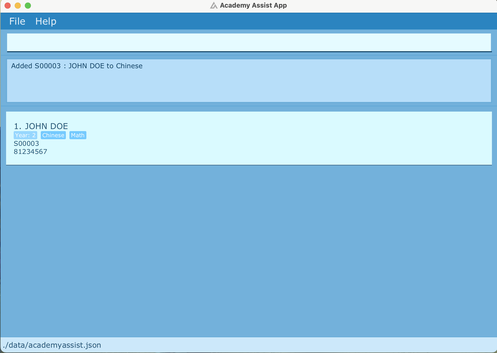
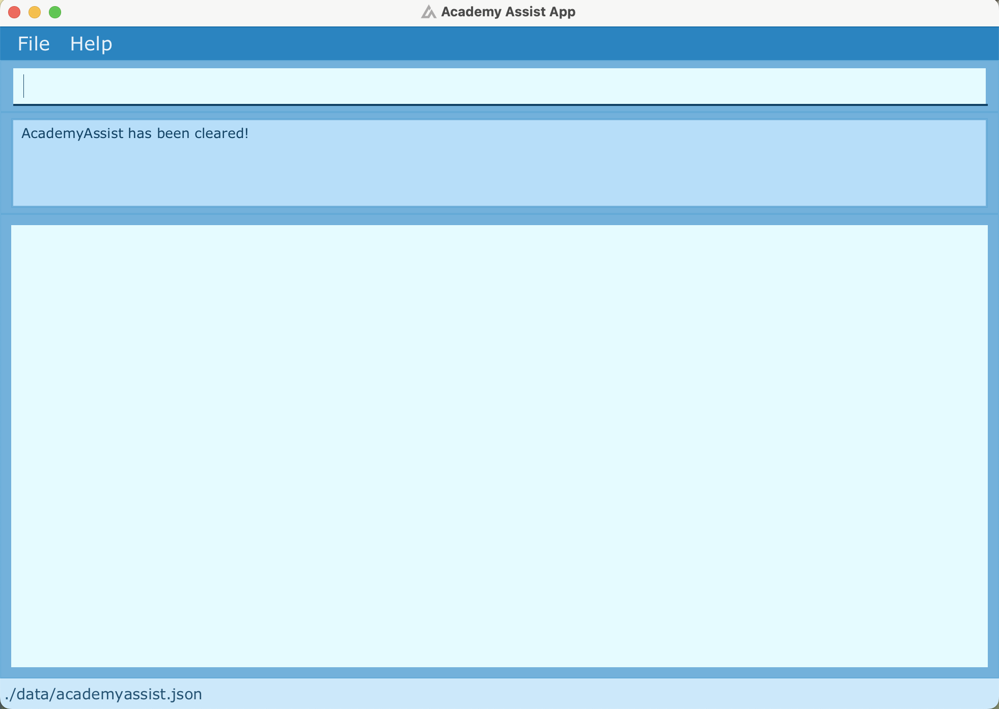
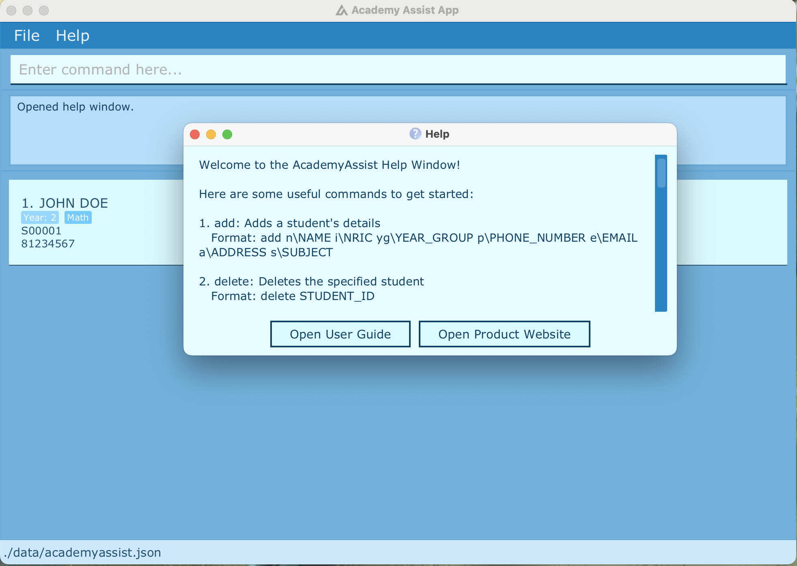

# Table of Contents

1. [Introduction](#introduction)

2. [Quick Start](#quick-start)
   * [Prerequisites](#prerequisites)
   * [Download AcademyAssist](#download-academyassist)
   * [Things to Note Before You Start](#things-to-note-before-you-start)
   * [Setting up AcademyAssist](#setting-up-academyassist)
      * [Non-Technical Users](#non-technical-users)
      * [Technical Users](#technical-users)
   * [Getting Started](#getting-started)

3. Command Summary
   * [General Format](#general-format)
   * [Command Format and Examples](#command-format-and-examples)
   * [Command Parameters Reference](#command-parameters-reference)
   * [Glossary](#glossary)

4. [Features](#features)
    * [Student Management](#student-management)
      * [Adding a student](#adding-a-student--add)
      * [Deleting a student](#deleting-a-student--delete)
      * [Editing a student](#editing-a-student--edit)
      * [Listing all students](#listing-all-students--list)
      * [Viewing a student's detail](#viewing-a-students-detail--detail)
    * [Searching and Sorting](#searching-and-sorting)
        * [Finding students](#finding-students--find)
        * [Sorting students](#sorting-students--sort)
        * [Filtering students](#filtering-students--filter)
    * [Subject Management](#subject-management)
        * [Adding subject(s) to a student](#adding-subjects-to-a-student--addsubject)
        * [Tracking student count for each subject](#tracking-student-count-for-each-subject--tracksubject)
    * [Utility Features](#utility-features)
        * [Clearing all entries](#clearing-all-entries--clear)
        * [Getting help](#getting-help--help)
        * [Exiting the program](#exiting-the-program--exit)

5. [Data Management](#data-management-in-academyassist)

6. [FAQ](#faq)

7. [Planned Features](#planned-features)

8. [Glossary](#glossary)

# Introduction
Welcome to **AcademyAssist**, your ultimate solution for efficient student contact management, targeted at tuition centers operating in Singapore.
This desktop application is designed to streamline your administrative tasks, allowing you to focus your efforts on 
keeping operations smooth and organized for optimal student support.

AcademyAssist is designed for a diverse range of users, primarily targeting tuition center administrators and 
administrative staff. Whether you are responsible for managing student information or need quick access to data for 
efficient operations, AcademyAssist is here to help.

AcademyAssist combines the power of a **Command Line Interface (CLI) with the user-friendly aspects of a Graphical
User Interface (GUI).** This hybrid approach ensures that you can manage your student database with
lightning-fast efficiency while still enjoying the visual benefits of modern software design. 

Whether you're a seasoned administrator or new to digital management systems, AcademyAssist is intuitive enough for beginners yet
powerful enough for experts. With features like quick **student addition, easy information retrieval,
and automated data saving**, AcademyAssist is set to revolutionize how you manage your tuition center.

Let's embark on this journey to **simpler, faster, and more effective** student management!

---

# Quick start
This guide provides step-by-step instructions for installing and running the AcademyAssist application for both non-technical
and technical users. Please follow the instructions that correspond to your level of expertise.

## Prerequisites
Before you begin, ensure you have Java `17` or above installed in your computer. 

### Check Java Version
1. Open up command prompt (Windows) or terminal (macOS, Linux).
2. Type `java -version` and press Enter to check your Java version.
3. If your Java version is not `17` or above, you will need to install the latest version.

### Download Java
1. Download the latest version of Java from the [Oracle website](https://www.oracle.com/java/technologies/javase/jdk17-archive-downloads.html).
   * For Windows users: Download the [Windows x64 Installer](https://www.oracle.com/java/technologies/downloads/#java17?er=221886).
   * For macOS users: Download the [macOS Installer](https://www.oracle.com/java/technologies/downloads/#java17?os=macos-11).
   * For Linux users: Download the [Linux x64 Compressed Archive](https://www.oracle.com/java/technologies/downloads/#java17?os=linux).
2. Follow the installation instructions provided on the download page. 
3. After installation, run the `java -version` command again to confirm that the installation was successful. 
4. Close the terminal after confirming the installation.

## Download AcademyAssist
Download the latest `academyassist.jar` file from the latest release in our [GitHub repository](https://github.com/AY2425S1-CS2103T-W11-3/tp/releases).
You can find the file under the `Assets` section of the release.

## Things to note before you start
When you first use AcademyAssist, some sample student contacts have been added to help you familiarise yourself with
our features. Once you are ready to manage your tuition center's students, simply use the clear command
to clear all existing contacts and reset the StudentID. 

<div markdown="span" class="alert alert-primary">::exclamation: **Caution:**
Please note that clear action is <span style="color:red;font-weight:bold">IRREVERSIBLE!</span> All student entries will be deleted permanently. 
</div>

## Setting up AcademyAssist
### Non-Technical Users
1. Create a new folder at your Desktop. (e.g. `AcademyAssist`)
2. Move the downloaded `academyassist.jar` file into this folder.
3. Open the command prompt (Windows) or terminal (macOS, Linux).
4. Navigate to the folder by typing the following command and pressing Enter:
   * For Windows: `cd Desktop\AcademyAssist`
   * For macOS and Linux: `cd Desktop/AcademyAssist`
5. Type `java -jar academyassist.jar` and press Enter to start the app. 

### Technical Users
1. Move the downloaded `academyassist.jar` file to a directory of your choice.
2. Open the command prompt (Windows) or terminal (macOS, Linux).
3. Navigate to the directory where the `academyassist.jar` file is located.
4. Type `java -jar academyassist.jar` and press Enter to start the app.

## Getting Started
For all users, upon first running the application, a help window will appear automatically, providing details on some basic features.
You may refer to the [Command Summary](#command-summary) section for a quick overview of the available commands. The [Features](#features) section provides a more detailed explanation of each feature.

### User Interface Overview


1. **Top Bar**: Contains the following buttons
    * **Help**: Click on this to view the help window.
    * **Exit**: Click on this to exit the application.
2. **Command Box**: Enter your commands here to interact with the application.
3. **Message Box**: Displays messages to the user. Which includes success messages, error messages, and help messages.
4**Student List**: Displays the list of students in the system.

### Using AcademyAssist 
To interact with AcademyAssist, type your commands into the command box and press Enter.
Here are some sample commands you can try out to get started:
1. Add a student: `add n\John Doe i\S1234567A yg\2 p\91234567 e\johndoe@yahoo.com a\10 Orchard Road s\Science s\Math`
2. Edit a student: `edit S00001 a\Clementi Street 14`
3. Delete a student: `delete S00001`
4. Find a student: `find John`
5. List all students: `list`
6. View a student's details: `detail S00001`
7. Sort students by name: `sort by\name`
8. Filter students by year group: `filter yg\2`
9. Add a subject to a student: `addsubject S00001 s\Science`
10. Track the number of students taking each subject: `tracksubject`

No worries if you make a mistake - AcademyAssist will guide you through the messages displayed in the message box.
You can also use the `help` command to view the help window at any time.

### Conclusion
You are now ready to use AcademyAssist! If you encounter any issues during installation or usage, please refer to this documentation or contact us via our email (academyassist@gmail.com). Enjoy using the application!

--------------------------------------------------------------------------------------------------------------------

# Command Summary
## General Format
The general format of commands in AcademyAssist is as follows:
```
COMMAND [PARAMETERS]
```
Where:
- `COMMAND` refers to the action you want to perform (e.g., `add`, `delete`, `edit`).
- `PARAMETERS` are the inputs required for the command to execute successfully.

<div markdown="span" class="alert alert-info">
:information_source: **Note:** Not all commands require parameters. Some commands are standalone and do not require any additional inputs.
Refer to the tables below or the [Features](#features) section for more details on each command.
</div>

## Command Format and Examples
This section provides a quick overview of the available commands for managing student records. Each command is accompanied by its format and an example to help you understand how to use it effectively.

| **Action**          | **Command Format**                                                                        | **Example**                                                                                 |
|---------------------|-------------------------------------------------------------------------------------------|---------------------------------------------------------------------------------------------|
| **Add Student**     | `add n\NAME i\NRIC yg\YEARGROUP p\PHONE e\EMAIL a\ADDRESS s\SUBJECT [s\MORE_SUBJECTS]...` | `add n\John Doe i\T3840859A yg\3 p\81003999 e\johndoe@gmail.com a\9 Smith Street s\Science` |
| **Delete Student**  | `delete STUDENT_ID`                                                                       | `delete S00001`                                                                             |
| **Edit Student**    | `edit STUDENT_ID FIELD\NEW_VALUE`                                                         | `edit S00001 a\New_Address`                                                                 |
| **List Students**   | `list`                                                                                    |                                                                                             |
| **View Student**    | `detail STUDENT_ID`                                                                       | `detail S00001`                                                                             |
| **Find Student**    | `find NAME [MORE_NAMES]`                                                                  | `find John Jane`                                                                            |
| **Filter Students** | `filter FIELD\VALUE`                                                                      | `filter yg\2`                                                                               |
| **Add Subject**     | `addsubject STUDENT_ID s\SUBJECT`                                                         | `addsubject S00003 s\Science`                                                               |
| **Track Subjects**  | `tracksubject`                                                                            |                                                                                             |
| **Sort Students**   | `sort by\FIELD`                                                                           | `sort by\name`                                                                              |
| **Clear Data**      | `clear`                                                                                   |                                                                                             |
| **Get Help**        | `help`                                                                                    |                                                                                             |
| **Exit**            | `exit`                                                                                    |                                                                                             |

## Command Parameters Reference
In this section, you'll find detailed information about the parameters for each command. Each command is broken down into its constituent parameters, including their prefixes, descriptions, and constraints. This reference will guide you in ensuring that your inputs are valid and conform to the required formats.

| **Command**             | **Parameter**     | **Prefix**                                         | **Description**                                                                                                                                | **Constraints**                                                                                                                                                                                                                                                                                                                                                                                                                                                     |
|-------------------------|-------------------|----------------------------------------------------|------------------------------------------------------------------------------------------------------------------------------------------------|---------------------------------------------------------------------------------------------------------------------------------------------------------------------------------------------------------------------------------------------------------------------------------------------------------------------------------------------------------------------------------------------------------------------------------------------------------------------|
| **Add Student**         | `NAME`            | `n\ `                                              | Name of the student.                                                                                                                           | 2-255 characters, only alphabets, spaces, and special characters (-/'), cannot start/end with special characters, no consecutive special characters and spaces.                                                                                                                                                                                                                                                                                                     |
|                         | `NRIC`            | `i\ `                                              | NRIC number of the student.                                                                                                                    | Must start with `S, T, F, G, M`, followed by 7 digits and an alphabet (e.g., S1234567A).                                                                                                                                                                                                                                                                                                                                                                            |
|                         | `YEARGROUP`       | `yg\ `                                             | Year group of the student.                                                                                                                     | Must be a number between 1-13.                                                                                                                                                                                                                                                                                                                                                                                                                                      |
|                         | `PHONE`           | `p\ `                                              | Phone number of the student.                                                                                                                   | 4-20 digits long, no spaces.                                                                                                                                                                                                                                                                                                                                                                                                                                        |
|                         | `EMAIL`           | `e\ `                                              | Email address of the student.                                                                                                                  | Emails should be in the format local-part@domain where the local-part contains only alphanumeric characters and the special characters +_.- (must start and end with alphanumeric characters, and cannot have consecutive special characters). The domain must consist of labels separated by periods, each starting and ending with alphanumeric characters, and may contain hyphens (no consecutive hyphens). The final label must be at least 2 characters long. |
|                         | `ADDRESS`         | `a\ `                                              | Address of the student.                                                                                                                        | Maximum 300 characters, can contain any characters, cannot be empty.                                                                                                                                                                                                                                                                                                                                                                                                |
|                         | `SUBJECT`         | `s\ `                                              | Subject(s) the student is enrolled in.                                                                                                         | Must be one of the available subjects; can add multiple subjects using repeated `s\` fields.                                                                                                                                                                                                                                                                                                                                                                        |
| **Delete Student**      | `STUDENT_ID`      | -                                                  | ID of the student to be deleted.                                                                                                               | Must be in the format S followed by a 5-digit number (e.g., S00001).                                                                                                                                                                                                                                                                                                                                                                                                |
| **Edit Student**        | `STUDENT_ID`      | -                                                  | ID of the student to be edited.                                                                                                                | Must be in the format S followed by a 5-digit number (e.g., S00001).                                                                                                                                                                                                                                                                                                                                                                                                |
|                         | `FIELD\NEW_VALUE` | `n\ `, `i\ `, `yg\ `, `p\ `, `e\ `, `a\ ` or `s\ ` | Field to be edited (e.g., Name(n), NRIC(i), Year Group(yg), Phone(p), Email(e), Address(a), Subject(s)) and new value for the specified field. | FIELD must be one of the specified fields and NEW_VALUE must follow the constraints of the specified field.                                                                                                                                                                                                                                                                                                                                                         |
| **View Student Detail** | `STUDENT_ID`      | -                                                  | ID of the student whose details are to be viewed.                                                                                              | Must be in the format S followed by a 5-digit number (e.g., S00001).                                                                                                                                                                                                                                                                                                                                                                                                |
| **Find Student**        | `KEYWORD`         | -                                                  | Keyword(s) to search for student names.                                                                                                        | Each keyword must be between 1-255 characters long contains only alphabets and special characters (-/'), separated by spaces.                                                                                                                                                                                                                                                                                                                                       |
| **Filter Students**     | `FIELD\VALUE`     | `yg\ ` or `s\ `                                    | Field and value to filter by (year group or subject).                                                                                          | FIELD must be either `yg` for year group or `s` for subject and VALUE must follow the constraints of the specified field.                                                                                                                                                                                                                                                                                                                                           |
| **Add Subject**         | `STUDENT_ID`      | -                                                  | ID of the student to whom subjects are to be added.                                                                                            | Must be in the format S followed by a 5-digit number (e.g., S00001).                                                                                                                                                                                                                                                                                                                                                                                                |
|                         | `SUBJECT`         | `s\`                                               | Subject(s) to be added to the student's record.                                                                                                | Must be one of the available subjects; can add multiple subjects using repeated `s\` fields.                                                                                                                                                                                                                                                                                                                                                                        |
| **Track Subjects**      | -                 | -                                                  | No parameters required.                                                                                                                        | -                                                                                                                                                                                                                                                                                                                                                                                                                                                                   |
| **Clear Data**          | -                 | -                                                  | No parameters required.                                                                                                                        | -                                                                                                                                                                                                                                                                                                                                                                                                                                                                   |
| **Get Help**            | -                 | -                                                  | No parameters required.                                                                                                                        | -                                                                                                                                                                                                                                                                                                                                                                                                                                                                   |
| **Exit**                | -                 | -                                                  | No parameters required.                                                                                                                        | -                                                                                                                                                                                                                                                                                                                                                                                                                                                                   |

--------------------------------------------------------------------------------------------------------------------
# Features

<div markdown="block" class="alert alert-info">

* Words in `UPPER_CASE` are the inputs to be supplied by the user.
  e.g `delete STUDENT_ID` means the user has to enter the ID number of the student to be deleted.

* Every student added will be assigned a unique, non-modifiable `STUDENT_ID` that begins with S followed by a 5 digit 
number (e.g. S00003).
<div markdown="span" class="alert alert-note">:memo: **Note:**
The `STUDENT_ID` of a student is non-replaceable once deleted. i.e. if you have one student with `STUDENT_ID
` S00001 and you delete that student, the next student you add will be assigned the next `STUDENT_ID` e.g. S00002 
(instead of replacing S00001).

</div>

* Parameters can be in any order.
  e.g. if the command specifies `n\NAME p\PHONE_NUMBER`, `p\PHONE_NUMBER n\NAME` is also acceptable.

* Items in square brackets are optional.
  e.g. `s\SUBJECT [s\MORE_SUBJECTS]` can be used as `s\SUBJECT` or `s\SUBJECT s\MORE_SUBJECTS`.

* Items with `...` after them can be repeated.
  e.g. `s\SUBJECT [s\MORE_SUBJECTS]...` can be used as `s\SUBJECT`, `s\SUBJECT s\SUBJECT`, `s\SUBJECT s\SUBJECT 
s\SUBJECT`.

* Commands are case-sensitive (e.g., `add` is not the same as `Add`). Hence, commands should be in lowercase.

* Prefixes are case-sensitive (e.g., `n\` is not the same as `N\`). Hence, prefixes should be in lowercase.

* Parameters are case-insensitive (e.g., `Science`, `SCIENCE`, `science` are treated as the same) except for sort 
function.

* Leading and trailing spaces will be removed from the parameters. Hence, the length of the parameters is not affected 
by the leading and trailing spaces.

* Extraneous parameters for commands that do not take in parameters (such as `tracksubject`,`help`, `list`, `exit` and 
`clear`) will be ignored.<br>
  e.g. if the command specifies `help 123`, it will be interpreted as `help`.

* If you are using a PDF version of this document, be careful when copying and pasting commands that span multiple
lines as space characters surrounding line-breaks may be omitted when copied over to the application.

</div>

## Student Management
### Adding a student : `add`

Adds a new student to the student management system.

Format: `add n\NAME i\NRIC yg\YEARGROUP p\PHONE e\EMAIL a\ADDRESS s\SUBJECT [s\MORE_SUBJECTS]...`

#### Parameters Constraints:
* `NAME` should not be blank and should between 2 and 255 characters long. Names should only contain alphabets, spaces,
and the special characters (-/') excluding parentheses. Names should start and end with an alphabet,
and there should not be more than one consecutive special character.
* `NRIC` is compulsory and should follow the format of Singaporean IC and FIN numbers. It should start with one of
  `S, T, F, G, M` followed by a 7-digit number and another alphabet (e.g., S1234567A). 
<div markdown="span" class="alert alert-note">:memo: **Note:**
Contacts added should not have the same NRIC number. New contacts having the same NRIC number as an existing
contact will be treated as a duplicate and will not be allowed.

</div>
* `YEAR_GROUP` is compulsory and should be a number within 1-13 (which represents primary school years 1 - 6 and
  secondary school years 7 - 13).
* `PHONE_NUMBER` should only contain number. It should be between 4 and 20 digits long with no spaces in between.
* `EMAIL` should follow the format username@domain. 
* `ADDRESS` allow any characters and should not be empty. The maximum length is 300 characters including spaces in 
between. 
* `SUBJECT` is compulsory, and you can add multiple subjects by repeating the `s\` field. Only subjects that are 
available within the tuition center will be allowed.
* `[MORE_SUBJECTS]` is optional and can be repeated to add more subjects.
<div markdown="span" class="alert alert-note">:memo: **Note:**
Repeated subjects will be ignored. For example, if you add `s\Science s\Science`, only one `Science` subject 
will be added.

</div>
* A student ID is automatically generated and assigned upon successful addition. It will be displayed in the success 
message and can be used for `addsubject`, `edit`, `detail` and `delete`.

Examples:
* `add n\Sam Tan i\T3848559A yg\3 p\81003999 e\samtan@gmail.com a\9 Smith Street \Science`
* `add n\John Doe i\S1234567A yg\2 p\91234567 e\johndoe@yahoo.com a\10 Orchard Road s\Science s\Math`



<div markdown="span" class="alert alert-primary">:bulb: **Tip:**
Some contact fields such as address and email are intentionally hidden to avoid cluttering of information. To view all 
the details of a student, you can use the [detail command] (#viewing-a-students-detail--detail).

</div>

### Deleting a student : `delete`

Removes a student from the tuition center management system.

Format: `delete STUDENT_ID`

* `STUDENT_ID` is compulsory and is of the format: S followed by a 5-digit, starting from 00001 to 99999. The ID of a 
student is automatically assigned when the student contact is first added and can be found by viewing the student's 
details.
<div markdown="span" class="alert alert-note">:memo: **Note:**
The `STUDENT_ID` of a student is non-replaceable once deleted. i.e. if you have one student with `STUDENT_ID
` S00001 and you delete that student, the next student you add will be assigned the next `STUDENT_ID` e.g. S00002 
(instead of replacing S00001).

</div>

<div markdown="span" class="alert alert-warning">:exclamation: **Caution:**
This action is irreversible. Once a student is deleted, the student's details will be permanently removed from the
system.
</div>

Examples:
* `delete S00001`



### Editing a student : `edit`

Edits an existing student's details in the system.

Format: `edit STUDENT_ID FIELD\NEW_VALUE`

* `STUDENT_ID` is compulsory and is of the format: S followed by a 5-digit, starting from 00001 to 99999. The ID of a 
student is automatically assigned when the student contact is first added and can be found by viewing the student's 
details.
* `FIELD` can be one of: Name(`n\ `), Phone Number(`p\ `), Email(`e\ `), Address(`a\ `), NRIC(`i\ `) or Subject 
taken(`s\ `).
* `NEW_VALUE` should follow the constraints of the specified field. You may refer to the constraints of each field 
in the [add feature](#adding-a-student--add) section.
* Although editing the NRIC is allowed, it must not match any other student's NRIC in the system. 
An error message will be shown if a duplicate is detected.
<div markdown="span" class="alert alert-warning">:exclamation: **Caution:**
When editing a contact, the previously saved value of FIELD will be replaced entirely by NEW_VALUE. e.g. 'edit S00001 
n\Henry Teo' replaces the name field of student S00001 with "Henry Tan". 

</div>

Examples:
* `edit S00001 a\New_Address`
* `edit s00002 p\91234567 a\New_Address`



<div markdown="span" class="alert alert-primary">:bulb: **Tip:**
To more efficiently add a subject to a person, see the [addsubject feature] (#adding-a-subject-to-a-student--addsubject)

</div>

<div markdown="span" class="alert alert-primary">:bulb: **Tip:**
To delete a subject, you can use the edit command. e.g. student S00120 takes the subjects English and Math, but wishes to 
drop the subject English, you can use the command 'edit S00120 s\Math'.

</div>

### Listing all students : `list`

Shows a list of all students in the system.

Format: `list`


### Viewing a student's detail : `detail`

Displays a window that shows the student's details.

Format: `detail STUDENT_ID`

* `STUDENT_ID` is compulsory and is of the format: S followed by a 5-digit, starting from 00001 to 99999. The ID of a student is
  automatically assigned when the student contact is first added and can be found by viewing the student's details.
* The student's details will be displayed in a pop-up window.
* User may use keyboard shortcut `B` to close the pop-up window.

Examples:
* `detail S00001`



## Searching and Sorting
<div markdown="span" class="alert alert-primary">:bulb: **Tip:**
All the following commands will update the list of students shown in the main window.
To return to the full list of students, use the `list` command.

</div>

### Finding students : `find`

Finds students whose name contains any of the given keywords.

Format: `find KEYWORD [MORE_KEYWORDS]`

* The search is case-insensitive (i.e. John, JOHN, john are all treated the same way).
* You can only search for a student by their name.
* `NAME` should not be blank and should between 2 and 255 characters long. Names should only contain alphabets, spaces,
and the special characters (-/') excluding parentheses. Names should start and end with an alphabet,
and there should not be more than one consecutive special character.
* Students matching at least one keyword will be returned.
<div markdown="span" class="alert alert-primary">:bulb: **Tip:**
After finding, you can use `list` command to return to the full list of students.

</div>
Examples:
* `find John` returns `John` and `John Doe`
* `find John Jane` returns any student having names `John` or `Jane`
* `find J` returns any student having names starting with `J`


### Sorting students : `sort`

Sort the list of students based on a specified field.

Format: `sort by\FIELD`

* `FIELD` can be either `name`, `subject`, `studentID` or `yearGroup`.
* Sorting by name will sort students in lexicographical ascending order of their names.
* Sorting by subject will sort students based on the lexicographically smallest subject they are taking.
* Sorting by studentID will sort students based on ascending order of studentID.
* Sorting by yearGroup will sort students in ascending order based on their year group.
<div markdown="span" class="alert alert-note">:memo: **Note:**
FIELD is case-sensitive (e.g., `NAME` is not the same as `name`). Hence, FIELDs should be in lowercase.

</div> 

<div markdown="span" class="alert alert-primary">:bulb: **Tip:**
Sort command will sort the current list of students shown in the main window.
For example, if you have filtered the list by year group 2 students and then use the `sort by\name` command, only year 
group 2 students will be sorted.

</div>

Examples:
* `sort by\name`
* `sort by\subject`
* `sort by\yearGroup`
* `sort by\studentID`


### Filtering students : `filter`

Shows a list of students filtered by year group or subject.

Format: `filter FIELD\VALUE`

* You can only filter by EITHER year group or class.
* You can only filter one value (eg. filter by Science only).

<div markdown="span" class="alert alert-primary">:bulb: **Tip:**
After filtering, you can use `list` command to return to the full list of students.

</div>

Examples:
* `filter yg\2` shows only students who belong to year group 2
* `filter s\Science` shows only students who take Science as a subject



## Subject Management
### Adding subject(s) to a student : `addsubject`

Adds one or more subjects to an existing student's record.

Format: `addsubject STUDENT_ID s\SUBJECT`

* `STUDENT_ID` is compulsory and is of the format: S followed by a 5-digit, starting from 00001 to 99999. The ID of a student is
  automatically assigned when the student contact is first added and can be found by viewing the student's details.
* `SUBJECT` is compulsory, and you can add multiple subjects by repeating the s/ field. Subjects are case-insensitive
  (i.e. science, SCIENCE, Science are treated the same way).
<div markdown="span" class="alert alert-note">:memo: **Note:**
Repeated subjects will be ignored. For example, if you add `s\Science s\Science`, only one `Science` subject will be added.

</div>
* Subjects available: English, Chinese, Malay, Tamil, Math, Further Math, Science, History, Geography, Literature,
Economics, Accounting, Business, Physics, Chemistry, Biology and Computing.

Examples:
* `addsubject S00001 s\Science`
* `addsubject S00002 s\Science s\Math`



### Tracking student count for each subject : `tracksubject`

Displays a window that shows how many students are taking each of all the subjects.

Format: `tracksubject`

* The subject count will be displayed in a pop-up window.
* User may use keyboard shortcut `B` to close the pop-up window.

<div markdown="span" class="alert alert-note">:memo: **Note:**
Track subject displays the number of students based on the filtered list. For example,
filtering by year 2 students followed by a `tracksubject` command will only show how many year 2 students 
are taking each of the subjects.

</div> 


## Utility Features
### Clearing all entries : `clear`

Clears all student entries from the system, and resets the studentID count to S00001.

<div markdown="span" class="alert alert-warning">:exclamation: **Caution:**
This action is irreversible. All student entries will be deleted permanently.

</div>

Format: `clear`



### Getting help : `help`

Shows a help window with details of how to use the different commands.

Format: `help`



### Exiting the program : `exit`

Exits the program.

Format: `exit`

---

# Data Management in AcademyAssist

Welcome to the Data Management section of AcademyAssist! Here, we'll explain how your important information
is stored and managed.

## How Your Data is Saved

Don't worry about constantly saving your work - AcademyAssist has got you covered! Here's what you need to know:

1. **Automatic Saving**: Every time you make a change, like adding a new student or updating information,
AcademyAssist saves it right away. You don't have to do anything!

2. **Where Your Data Lives**: All your information is safely stored on your computer in a special file.
It's like a digital filing cabinet just for AcademyAssist.

3. **Easy to Understand**: We use a format called JSON to store your data. While you don't need
to know the details, it's designed to be easy for both computers and humans to read if needed.

## Keeping Your Data Safe

Your information is important, so here are some tips to keep it secure:

1. **Make Backups**: It's always a good idea to have an extra copy of your data. Once a week,
why not copy your AcademyAssist file to a USB drive or cloud storage?

2. **Be Careful with Editing**: While it's possible to open and edit the data file directly, we don't recommend
it unless you're an expert in CLI applications. It's safer to make changes through the AcademyAssist program.


## What If Something Goes Wrong?

Don't panic! AcademyAssist is designed to handle most issues smoothly. But if you do run into problems:

1. **Check for Messages**: If there's an issue loading your data, AcademyAssist will show a helpful
message explaining what's wrong.

2. **Use Your Backup**: This is where your backup copy comes in handy. You can replace the problematic
file with your backup to get back on track.

Remember, AcademyAssist is here to make managing student information easy and stress-free.
If you ever have questions about your data, just ask - we're always happy to help! You can reach us via our email 
(academyassist@gmail.com).


--------------------------------------------------------------------------------------------------------------------

# FAQ

**Q**: How do I transfer my data to another Computer?<br>
**A**: Install the app in the other computer and overwrite the empty data file it creates with the file that contains
the data of your previous AcademyAssist folder.<br><br>
**Q**: Why is there a gap in the studentID after I deleted a student?<br>
**A**: This is an intentional design, kindly refer to the note under [Features](#features) for more details.

--------------------------------------------------------------------------------------------------------------------

# Planned Features
As part of our ongoing efforts to enhance the functionality of the student management system, we are excited to 
introduce the following features aimed at providing greater flexibility in subject management:

1. **Create Subject**: Allow users to create their own subjects. Currently, the application only permits a restricted
set of predefined subjects. With this feature, users will be able to tailor the subjects offered in their tuition center
based on their specific needs.
<br><br>
2. **Delete Subject**: Enable users to delete subjects that are no longer offered by the tuition center. This feature
will also automatically remove the subject tag from students currently enrolled in that subject, ensuring accurate and
up-to-date records.
<br><br>
3. **Drop Subject**: Allow users to modify the subjects taken by students by dropping a subject. Currently, the system
only supports adding subjects, and if a user wants to remove a subject from a student’s record, they must use the edit
feature and manually note the remaining subjects. This new feature will streamline the process and enhance usability.

### Conclusion
These planned features are designed to improve the administrative capabilities of our student management system, allowing for more efficient subject management. We welcome your feedback and suggestions as we work towards implementing these enhancements!
# Glossary
1. **Command**: An instruction given by a user to a computer program.
2. **Command Line Interface (CLI)**: A text-based interface for interacting with a program.
3. **Graphical User Interface (GUI)**: A visual interface that allows users to interact with a program using graphical elements.
4. **Command Prompt (Windows)/ Terminal (macOS, Linux)**: A text-based interface for entering commands to interact with the operating system.
5. **Java**: A high-level, class-based, object-oriented programming language that is designed to have as few implementation dependencies as possible.
6. **JSON**: JavaScript Object Notation, a lightweight data-interchange format that is easy for humans to read and write and easy for machines to parse and generate.
7. **StudentID**: A unique identifier assigned to each student in the system, starting from S00001 to S99999.
8. **NRIC**: National Registration Identity Card, a unique identifier assigned to Singapore residents and citizens.
